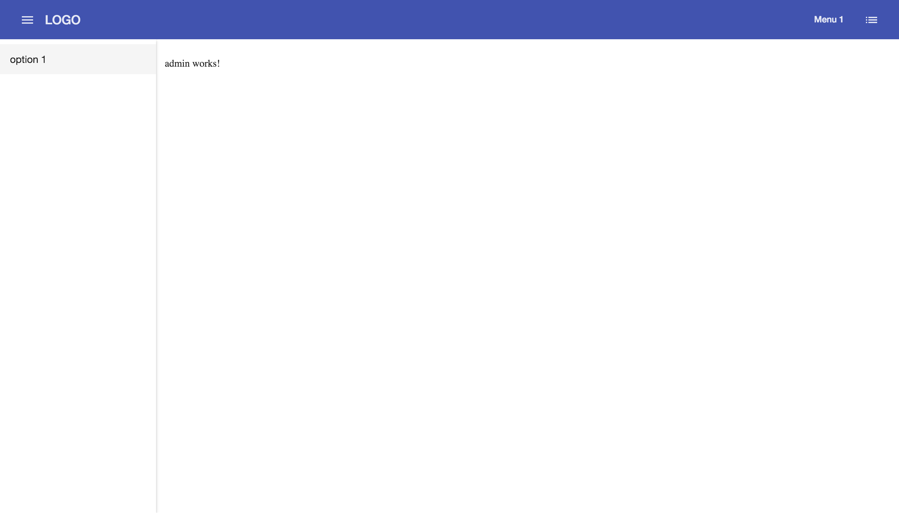

# Notice
This repo is under rapid development and the skeleton will be updated a couple times a week until 2/1/2018
Great things are coming!

Next steps:
- Make the sidenav into a model driven one
- Complete the top navbar
- Make it mobile friendly and responsive
- Add in search bar
- Add in notifications popout
- Add in more prebuilt scss styles

Current Look (With sidenav.toggle() = true):


## Requirements

- nvm (node version manager)
- npm : latest
- node : latest
- angular cli
- virtualenv

Install nvm (MAC):

```
curl https://raw.githubusercontent.com/creationix/nvm/v0.25.0/install.sh | bash
close terminal and reopen
nvm --version
```

Install nvm (WINDOWS):

```
- https://github.com/coreybutler/nvm-windows/releases
- close terminal and reopen
- nvm --version
```

Install node and npm (with nvm):

```
nvm install 8
npm -v
node -v
```

Install Angular CLI:

```
npm install -g @angular/cli
ng -v
```

Install virtualenv:

```
pip install virtualenv
```

VIRTUALENV MAC:

```
virtualenv env
source env/bin/activate
```

VIRTUALENV WINDOWS:

```
virtualenv env
cd env/Scripts
./activate
```

## Setup

1. open terminal

```
cd desktop
mkdir [Directory Name]
cd [Directory Name]
git clone https://github.com/hawzie197/angular5-material-skeleton.git
```

2. create virtual environment in [Directory Name] (see above for mac vs windows), and from within :

```
cd angular5-material-skeleton
ng serve
```


## Development server

Run `ng serve` for a dev server. Navigate to `http://localhost:4200/`. The app will automatically reload if you change any of the source files.

## Code scaffolding

Run `ng generate component component-name` to generate a new component. You can also use `ng generate directive|pipe|service|class|guard|interface|enum|module`.

## Build

Run `ng build` to build the project. The build artifacts will be stored in the `dist/` directory. Use the `-prod` flag for a production build.

## Running unit tests

Run `ng test` to execute the unit tests via [Karma](https://karma-runner.github.io).

## Running end-to-end tests

Run `ng e2e` to execute the end-to-end tests via [Protractor](http://www.protractortest.org/).

## Further help

To get more help on the Angular CLI use `ng help` or go check out the [Angular CLI README](https://github.com/angular/angular-cli/blob/master/README.md).

